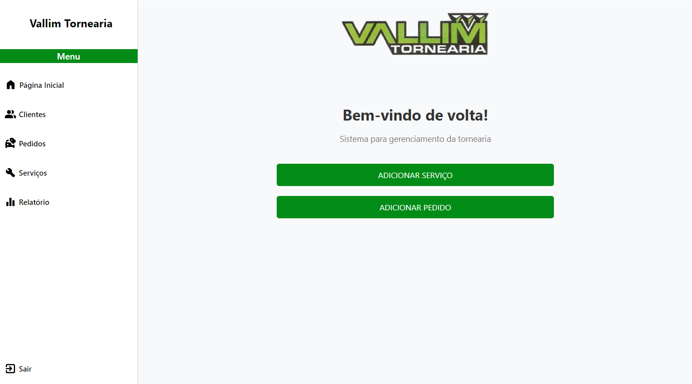
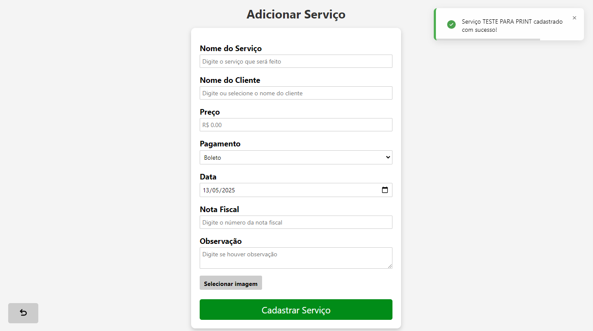
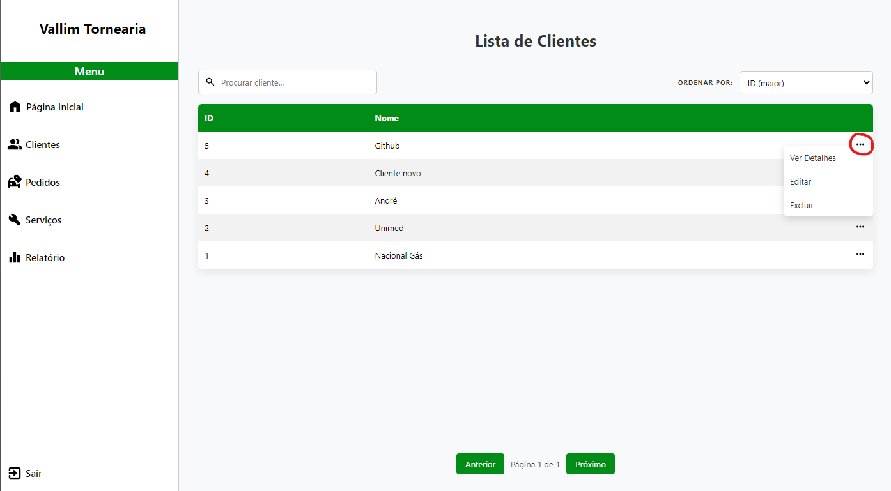
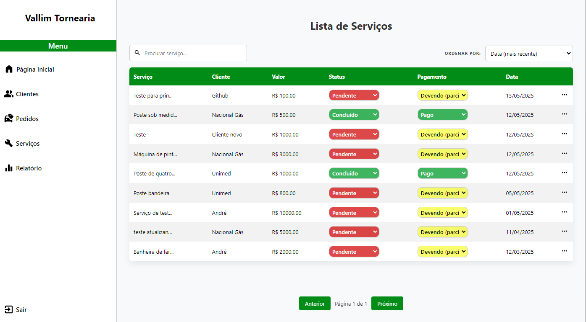

# Sistema para Tornearia
> ⚠️⚠️ Esse sistema está passando por adição de novas funcionalidades.
> Por conta disso e segurança, o código foi não foi adicionado nesse repositório público (será em breve). ⚠️⚠️

<p align="center">
  
</p>
<p align="center">
  
  
</p>
<p align="center">
  
</p>

## 🛠️ Sobre o Projeto

Esse sistema foi desenvolvido para atender as necessidades de uma tornearia local que ainda realizava todo o controle de pedidos e serviços de forma manual. O objetivo foi digitalizar esses processos de forma simples, rápida e totalmente offline.

O sistema conta com:
- API em Node.js com arquitetura MVC.
- Banco de dados SQLite, leve e ideal para uso offline com backup rápido.
- Interface desktop criada com Electron.
- Integração completa entre frontend e backend.
- Telas para gerenciamento de **clientes**, **serviços**, **pedidos/gastos** e **relatório financeiro** com dashboards.

Todo o projeto foi estruturado com base em conversas diretas com o cliente, entendendo os principais pontos de dor e aplicando boas práticas de desenvolvimento.

---

## 🚀 Como rodar o projeto localmente

### Pré-requisitos
- Ter o [Node.js](https://nodejs.org/) instalado (versão 12+)
- Git instalado para clonar o repositório

### Passos:

```bash
# 1. Clone o repositório
git clone https://github.com/seu-usuario/nome-do-repositorio.git

# 2. Acesse a pasta do projeto
cd nome-do-repositorio

# 3. Instale as dependências
npm install

# 4. Rode o sistema
npm start

Após isso, o aplicativo será aberto em modo desktop via Electron.
```

## 📦 Tecnologias Utilizadas
- Node.js – Backend da aplicação
- Express – Framework para criação das rotas
- SQLite – Banco de dados leve e rápido
- Electron – Para transformar a aplicação em um sistema desktop offline
- HTML, CSS e JavaScript – Construção da interface do usuário
- Insomnia – Para testes de rotas e validação da API durante o desenvolvimento

## 💡 Diferenciais do Projeto
- Totalmente offline, ideal para negócios sem conexão com internet
- Backup simples e rápido do banco de dados
- Processo de pedidos e clientes digitalizado, eliminando papel e retrabalho
- Interface acessível e pensada para usuários não técnicos

## 📋 Organização do Código
O projeto está estruturado em MVC (Model - View - Controller), facilitando a manutenção e escalabilidade da aplicação, além de ter arquivos reutilizáveis no front-end.

## 🧪 Testes
As rotas da API foram testadas utilizando o Insomnia, simulando os fluxos principais da aplicação:
- Cadastro, edição e remoção de clientes
- Registro e controle de pedidos
- Gerenciamento de serviços disponíveis

## 📌 Observações Finais
Esse projeto foi desenvolvido como parte do meu processo de aprendizado e conclusão da graduação em Engenharia de Software. A ideia foi aplicar conceitos de backend, frontend, banco de dados e integração com Electron em um sistema real, que hoje já está em uso por uma tornearia local.

## Attribute
- **Icon**:
<div> Icons made by <a href="https://www.flaticon.com/authors/riajulislam" title="riajulislam"> riajulislam </a> from <a href="https://www.flaticon.com/" title="Flaticon">www.flaticon.com'</a></div>